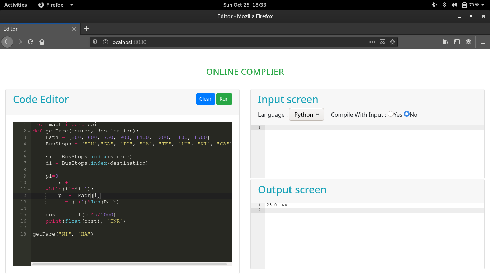
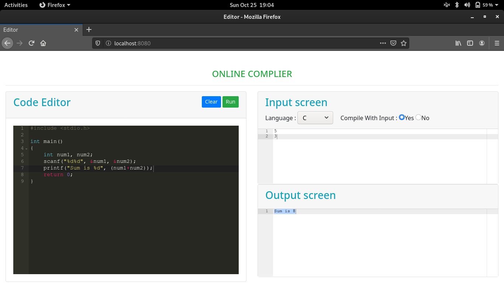

# Web-based Compiler
It is an implementation of compilex module. It provides an interface to run your programs on the browser.

## Installation instruction
```bash
sudo apt install nodejs npm  # If not already installed
git clone https://github.com/marvellouschandan/web-based-compiler
cd web-based-compiler
npm install  # To install the required dependencies
node app.js
```

Now fire-up the below url to start the application

> localhost:8080

## Screenshots
1. Python

2. C language


> NOTE: Python, C must have been installed in your PC to actually compile your program.
> Currently Java is not supported because of some bugs, will be improved in future versions.
